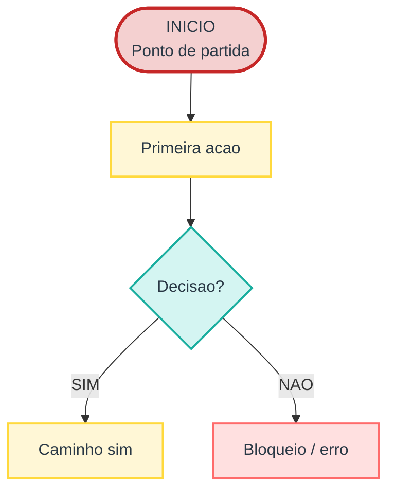
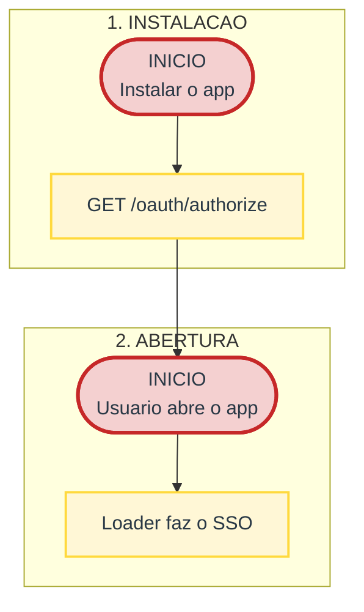

# Diagramas Mermaid para Whimsical

Produz um arquivo `.mmd` que o usuario **copia e cola** no Whimsical.
Nao e upload/import de arquivo — e paste de texto.

Esta skill e **autonoma**: as regras de formato abaixo sao completas e nao dependem de
nenhum outro arquivo, ferramenta ou contexto externo.

## Onde salvar

**Sempre no projeto em que se esta trabalhando** — na raiz do repositorio/projeto atual
(o `cwd` da sessao), ou no diretorio que o usuario indicar.

- Nome do arquivo: `<slug-do-tema>.mmd` (ex: `fluxo-checkout.mmd`, `arquitetura-app.mmd`).
- Se o usuario pedir um caminho/nome especifico, use o que ele pediu.
- **Nunca** salve fora do projeto por conta propria.

## Formato do arquivo

- **Mermaid puro**: sem cerca de codigo markdown, sem texto em volta, sem comentarios.
- Encoding UTF-8, acentos preservados.
- Layout: `graph TD` (top-down).

## Skeleton — comece sempre assim



Regras do skeleton (todas obrigatorias):
`classDef` **sem** `;` no fim · quebra de linha com `<br/>` (nunca `\n`) · rotulos de seta
entre aspas `|"SIM"|` · classes aplicadas com `:::classe`.

## Sintaxe validada

Use **somente** isto:

| Elemento | Sintaxe | Classe |
| --- | --- | --- |
| Inicio | `ID([INICIO<br/>texto])` | `inicio` |
| Acao / passo | `ID[Texto]` | `acao` |
| Decisao | `ID{Texto?}` | `decisao` |
| Funil / etapa de conversao | `ID[Texto]` | `funil` |
| Backend / seguranca / regra | `ID[Texto]` | `consultoria` |
| Erro / bloqueio / exclusao | `ID[Texto]` | `exclusao` |
| Espera / follow-up / loop | `ID[Texto]` | `loop` |
| Quebra de linha no label | `<br/>` | — |
| Rotulo de seta | `-->|"SIM"|` | — |
| Aplicar classe | `:::classe` ou `class A,B classe` | — |

## Nao use

Nao aparece no formato aprovado e nao foi validado no Whimsical:

- cilindro `[(texto)]`
- retangulo arredondado `(texto)` como forma padrao
- seta pontilhada `-.->`
- conexao sem seta `---`
- `\n` dentro do label (use `<br/>`)
- `;` no fim do `classDef`
- `subgraph` aninhado (subgraph dentro de subgraph)
- `style` inline por no (prefira `classDef` + `:::`)

## Classes extras

O nome da classe e livre. Se precisar de mais semantica, crie novas `classDef`
seguindo o mesmo padrao (fundo claro + `stroke-width:2px` + `color:#293845`).
Exemplos ja validados:

```
classDef backend fill:#ECEAFE,stroke:#730FC3,stroke-width:2px,color:#293845
classDef dado fill:#E3F0FF,stroke:#74B9FF,stroke-width:2px,color:#293845
classDef ui fill:#E8F5E9,stroke:#2E7D32,stroke-width:2px,color:#293845
classDef store fill:#F1F1F6,stroke:#6B7280,stroke-width:2px,color:#293845
```

## Diagramas grandes → subgraph por secao

Acima de ~25 nos, agrupe em subgraphs tematicos (uma secao/fase por subgraph). E o que
mantem um diagrama de 100+ nos legivel no Whimsical.

O bloco abaixo e um diagrama **completo** — `graph TD` + `classDef` sao obrigatorios;
um `subgraph` sozinho nao e um documento Mermaid valido:



Nos podem ser referenciados entre subgraphs normalmente (`A1 --> B0`).

## Auto-verificacao (obrigatoria antes de entregar)

1. **Renderize o `.mmd`** com Mermaid 11 e confirme que nao ha erro + a contagem de nos.
   Receita: gere uma pagina HTML que importa
   `https://cdn.jsdelivr.net/npm/mermaid@11/dist/mermaid.esm.min.mjs`, le o texto do `.mmd`
   (ex: num `<script type="text/plain">`), chama `await mermaid.render('id', texto)` e
   escreve o SVG resultante no DOM. Sirva a pagina por HTTP (um servidor estatico simples
   em qualquer porta) e abra com
   `chrome --headless --disable-gpu --no-sandbox --virtual-time-budget=40000 --dump-dom <url>`.
   Use o `--headless` classico (nao `--headless=new`).
2. Se der, tire um screenshot (`--screenshot=<arquivo>.png --window-size=1700,3000`) e
   inspecione visualmente.
3. **Nunca entregue sem renderizar.** O paste no Whimsical e sensivel ao subconjunto acima.

## Checklist antes de entregar

- [ ] Arquivo `.mmd` salvo no projeto atual, com nome descritivo
- [ ] Mermaid puro (sem cerca de codigo, sem texto em volta)
- [ ] `graph TD` + bloco de `classDef` no topo (sem `;`)
- [ ] So formas `[ ]`, `{ }` e `([ ])`
- [ ] `<br/>` para quebras, rotulos de seta entre aspas
- [ ] Renderizou sem erro (contagem de nos conferida)
